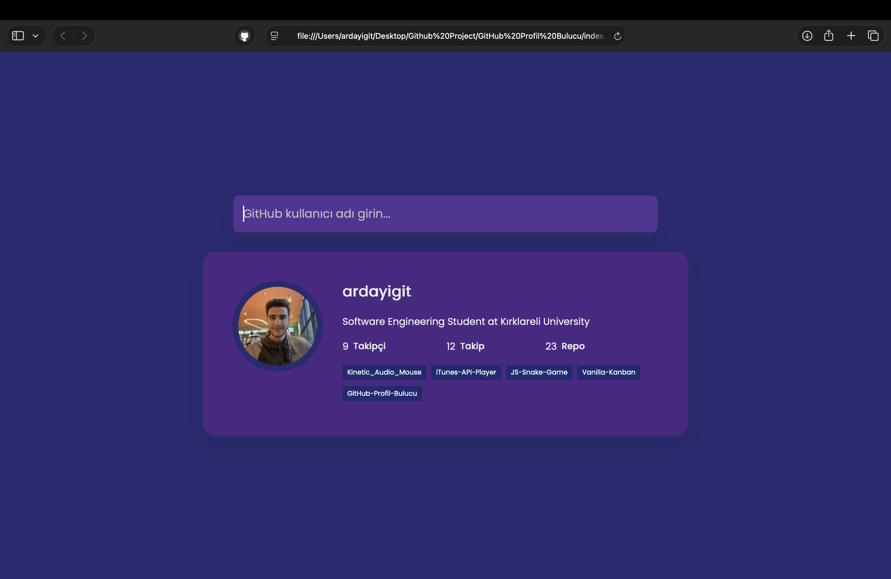

# 🔍 GitHub Profile Finder


A responsive web application that utilizes the **GitHub REST API** to search for users and display their profile information and latest repositories.

## 🚀 Live Demo

[>> Click here to view the Live Demo <<](https://ygtarda.github.io/github-profile-finder)
## 📸 Screenshot


## 💡 Features

* **User Search:** Real-time search functionality using GitHub usernames.
* **Profile Stats:** Displays user bio, followers, following, and public repo counts.
* **Latest Repositories:** Fetches and lists the latest 5 repositories created by the user.
* **Direct Links:** Clickable repository tags that lead directly to the project pages.
* **Error Handling:** Custom "404 Not Found" card for invalid usernames.
* **Responsive Design:** Fully optimized for desktop, tablet, and mobile screens.

## 🛠️ Technologies Used

* **HTML5 & CSS3:** For structure and modern styling (Flexbox).
* **Vanilla JavaScript (ES6+):** DOM manipulation and logic.
* **Axios:** For making asynchronous HTTP requests to the GitHub API.
* **Async/Await:** For handling asynchronous operations cleanly.

## 💻 Getting Started

To run this project locally, follow these steps:

1.  **Clone the repository**
    ```bash
    git clone [https://github.com/ygtarda/github-profile-finder.git](https://github.com/ygtarda/github-profile-finder.git)
    ```

2.  **Navigate to the project directory**
    ```bash
    cd github-profile-finder
    ```

3.  **Open `index.html`**
    You can open the file directly in your browser or use a live server extension in VS Code.

## 🧠 What I Learned

While building this project, I improved my skills in:
* Consuming 3rd party APIs (GitHub API).
* Handling JSON data and rendering it dynamically to the DOM.
* Using external libraries like `Axios` for cleaner HTTP requests.
* Implementing Error Handling (Try/Catch blocks) for a better user experience.

## 👤 Author

**Arda Yiğit**
* GitHub: [@ygtarda](https://github.com/ygtarda)
* LinkedIn: [Arda Yiğit](https://www.linkedin.com/in/arda-yigit)

---
*If you liked this project, please give it a ⭐!*